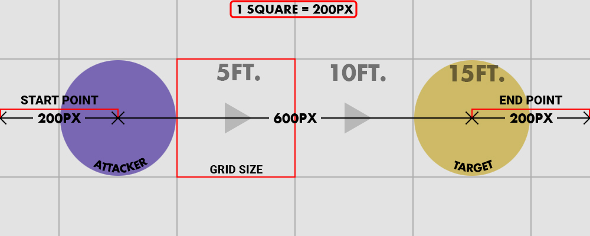
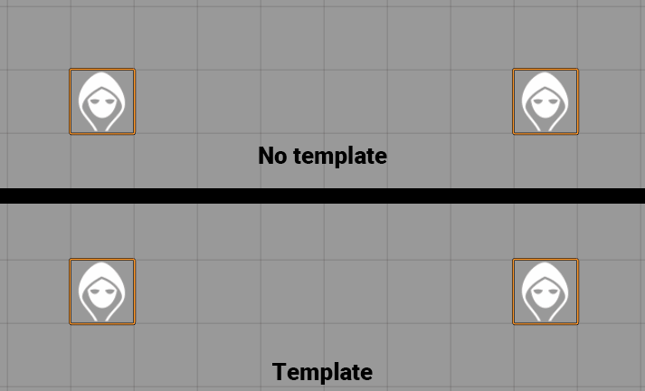

## Class Definitions
All of the methods are listed in the [Sequencer Database wiki article](database/database.md).

## Opening the Database Viewer

You can open database viewer by calling:
```js
Sequencer.DatabaseViewer.show()
```
or by pressing this button:


This will open this UI, where you can preview any of the effects in the database by pressing the play button on the far left. The following buttons copy the database path and the filepath, respectively.


## Why does the Sequencer need a database?

While the Sequencer is powerful, it's not _particularly_ user friendly, which means it's important to make it easier for users who want to utilize your effects and sounds.

You can register your files on the Sequencer database, and users can then easily access your effects and sounds without having to go digging through your module's folders to find them.

This also means that if you rename your files or move them to a different directory but keep the data structure the same, all of the users' macros and scripts will still work!

## How to register your files

Registering files is as easy as shown below:

```js
const database = {
    effects: {
        generic: {
            explosions: "modules/your_module_name/Library/VFX/Generic/Explosion/explosion_01.webm"
        }
    },
    sounds: {
        generic: {
            explosions: [
                "modules/your_module_name/Library/SFX/Generic/Explosion/explosion_01.ogg",
                "modules/your_module_name/Library/SFX/Generic/Explosion/explosion_02.ogg",
                "modules/your_module_name/Library/SFX/Generic/Explosion/explosion_03.ogg"
            ]
        }
    }
}

Hooks.on("sequencerReady", () => {
    Sequencer.Database.registerEntries("your_module_name", database);
});
```

The `data` variable is your structure, which can be set up in any way you want, as long as it eventually ends up at a file path, or an array (a list) of file paths.

Keep in mind, **this hook fires when Foundry is first launched**, which means that the above example will not work if you run it outside of a module's scripts. To run it in a macro, change the last three lines to:

```js
Sequencer.Database.registerEntries("your_module_name", database);
```

In the above example, I registered one explosion effect and three sounds, which means that if users has both the Sequencer and your module installed, they can use your files like this:

```js
new Sequence()
    .effect()
        .file("your_module_name.effects.generic.explosions")
        .atLocation(token)
    .sound()
        .file("your_module_name.sounds.generic.explosions")
    .play()
```

This will play the explosion effect on the selected token, and play one of the sounds in the list, which is picked randomly. If `sounds.generic.explosions` was just one file, it would play just that one sound.

In addition, if you were to add multiple file paths like this:
```js
const database = {
    effects: {
        generic: {
            explosions: {
                red: "modules/your_module_name/Library/VFX/Generic/Explosion/explosion_red_01.webm",
                blue: "modules/your_module_name/Library/VFX/Generic/Explosion/explosion_blue_01.webm",
                green: "modules/your_module_name/Library/VFX/Generic/Explosion/explosion_green_01.webm",
                purple: "modules/your_module_name/Library/VFX/Generic/Explosion/explosion_purple_01.webm"
            }
        }
    }
}
```
A user could put this into the effect: `your_module_name.effects.generic.explosions` and the Sequencer would pick one random explosion from your colors.

## Range-finding effects

In addition, if you define your structure like this:

```js
const database = {
    fire_bolt: {
        dark_red: {
            "30ft": "modules/jb2a_patreon/Library/Cantrip/Fire_Bolt/FireBolt_01_Dark_Red_30ft_1600x400.webm",
            "60ft": "modules/jb2a_patreon/Library/Cantrip/Fire_Bolt/FireBolt_01_Dark_Red_60ft_2800x400.webm",
            "90ft": "modules/jb2a_patreon/Library/Cantrip/Fire_Bolt/FireBolt_01_Dark_Red_90ft_4000x400.webm"
        }
    }
}
```

This will make it so that if you pass `your_module_name.fire_bolt.dark_red` to an effect in the Sequencer, and the effect has a source and a target, the Sequencer will determine the best one to use for the distance between the source and the target.

The current supported ranges are:
- "05ft"
- "15ft"
- "30ft"
- "60ft"
- "90ft"

You do not need all of them, the Sequencer will find the best one for the effect depending on the distance.

## Why templates are useful

In some cases, content creators may have effects with internal an internal grid size and padding to maintain consistency of size and distances, like in the case of [JB2A](https://jb2a.com/)'s assets.

They have decided on an internal grid of 200 pixels, with a start and end padding of 200 pixels:



In this case, you simply need to define a `_templates` section at the start of your database, and then refer to those templates within individual sections through `_template`, like so:

```js
const database = {
    _templates: { // Grid size, start point, end point
        "default": [200, 0, 0],
        "ranged": [200, 200, 200]
    },
    effects: {
        fire_bolt: {
            dark_red: {
                _template: "ranged",
                "30ft": "modules/jb2a_patreon/Library/Cantrip/Fire_Bolt/FireBolt_01_Dark_Red_30ft_1600x400.webm",
                "60ft": "modules/jb2a_patreon/Library/Cantrip/Fire_Bolt/FireBolt_01_Dark_Red_60ft_2800x400.webm",
                "90ft": "modules/jb2a_patreon/Library/Cantrip/Fire_Bolt/FireBolt_01_Dark_Red_90ft_4000x400.webm"
            }
        },
        generic: {
            explosions: "modules/your_module_name/Library/VFX/Generic/Explosion/explosion_01.webm"
        }
    },
}
```

If there's no template found (like with `effects.generic.explosion`), it will use the "default" entry in the `_templates`.

If no "default" entry is found, it will then fall back to the Sequencer default of 100 pixel grid size, 0 start point, and 0 end point.

## No template vs template

See the difference between having no template and having a template:



## Internal Loops

If you define the following structure:

```js
complete: {
    _markers: {
        loop: { start: 1533, end: 5566 },
        forcedEnd: 6566
    },
    blue: "modules/jb2a_patreon/Library/1st_Level/Shield/Shield_03_Regular_Blue_Complete_400x400.webm"
}
```

This will cause the effect to be able to be looped without having to split the animation into "in", "loop", and "out" animations. The system will recognize the times given, and cause the effect to loop between 1533ms (at the 1.533 seconds mark of the effect) and 5566ms (5.566 seconds into the effect), and stay within that loop for as long as the effect persists.

Once ended, the effect will jump to the `forcedEnd` part of the effect (if present), otherwise it will simply wait out the effect until it ends naturally from wherever it is within the loop.

This is applied to every file on the same level and below.

## Time ranges within files

Last, but not least, is the fact that you also have the ability to add specific timeranges to the database.

By defining `_timeRange` within a portion of your database, either next to a `file` or within a section shown below, loading that file from the database will automatically set up the timeranges to be played.

This means you can have one sound file with multiple portions within it that can be played as if they were separate files.

```js
const database = {
    sounds: {
        generic: {
            _timeRange: [0, 100],
            explosion: "modules/your_module_name/Library/SFX/Generic/Explosion/explosion_01.ogg",
        },
        steps: [
            { file: "Music/Sound_Effects/Steps.wav", _timeRange: [0, 100] },
            { file: "Music/Sound_Effects/Steps.wav", _timeRange: [120, 220] },
            { file: "Music/Sound_Effects/Steps.wav", _timeRange: [240, 340] },
            { file: "Music/Sound_Effects/Steps.wav", _timeRange: [360, 480] },
        ]
    }
}
```
