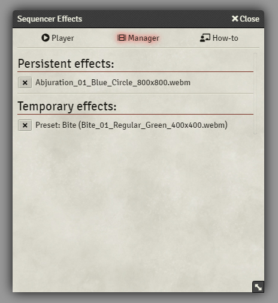

## Global Reference

You can access the global Sequencer Effect Manager through:

```js
Sequencer.EffectManager
```

## Show Effect Manager

You can either call this method:
```js
Sequencer.EffectManager.show()
```
Or press this button


This will open this UI, where you can end any of your own effects currently playing on the canvas. If you are a GM, you can end any effects:



## Get Effects

`Sequencer.EffectManager.getEffects(inFilters)`

```js
inFilters = {
    name: String, // From the .name() method on effects, can have wildcards in them (such as "fireball_*" to match anything that starts with "fireball_")
    object: PlaceableObject|String,  // Token, Tile, etc, or its id
    source: PlaceableObject|Document|String, // Token, Tile, etc, Document, or an UUID
    target: PlaceableObject|Document|String, // Token, Tile, etc, Document, or an UUID
    sceneId: String, // Default to current scene ID
    origin: String // From the .origin() method on effects
}
```

<details>
  <summary><strong>------ Click for examples ------</strong></summary><br />

```js
// Retrieves every effect named "test_effect"
const effects = Sequencer.EffectManager.getEffects({ name: "test_effect" })

// Retrieves effects named "test_effect" on a specific token
const effects = Sequencer.EffectManager.getEffects({ name: "test_effect", object: token })

// Retrieves effects that have "test" in their name
const effects = Sequencer.EffectManager.getEffects({ name: "*test*" })
```
<strong>--------------------------------</strong>

</details>

This will return any effect(s) that match the given filters. If an object is given, it will return all effects on the object (on the current scene). If given a name and an object, it will return all effects that match that name (see [`.name()`](https://github.com/fantasycalendar/FoundryVTT-Sequencer/wiki/Effects#name)) on that object.

## End Effects

`Sequencer.EffectManager.endEffects(inFilters)`

```js
inFilters = {
    name: String, // From the .name() method on effects, can have wildcards in them (such as "fireball_*" to match anything that starts with "fireball_")
    object: PlaceableObject|String,  // Token, Tile, etc, or its id,
    effects: CanvasEffect|String,  // The actual effect, or an ID of an effect,
    source: PlaceableObject|Document|String, // Token, Tile, etc, Document, or an UUID
    target: PlaceableObject|Document|String, // Token, Tile, etc, Document, or an UUID
    sceneId: String, // Default to current scene ID
    origin: String // From the .origin() method on effects
}
```

<details>
  <summary><strong>------ Click for examples ------</strong></summary><br />

```js

// Ends every effect named "test_effect"
await Sequencer.EffectManager.endEffects({ name: "test_effect" })

// Ends effects named "test_effect" on a specific token
await Sequencer.EffectManager.endEffects({ name: "test_effect", object: token })

// Ends effects that have "test" in their name
const effects = Sequencer.EffectManager.getEffects({ name: "*test*" })

```
<strong>--------------------------------</strong>

</details>

Functionally the same as `getEffects`, except this instead ends any effect(s) that match the given filters.

You can only end effects you created, unless you are a GM.

## End All Effects

`Sequencer.EffectManager.endAllEffects(inSceneId)`

<details>
  <summary><strong>------ Click for examples ------</strong></summary><br />

```js

// Ends all effects in the current scene
await Sequencer.EffectManager.endAllEffects()

// Ends all effects in the scene with the ID of "ULohafjBlsTRST8F"
await Sequencer.EffectManager.endAllEffects("ULohafjBlsTRST8F")

```
<strong>--------------------------------</strong>

</details>

This will end _all_ effects on the current scene (if no scene ID is provided), or on the given scene.

This is a GM only method.
