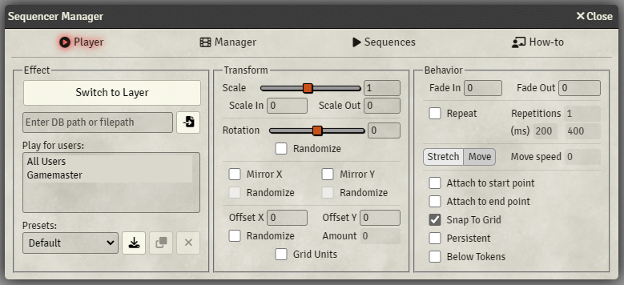
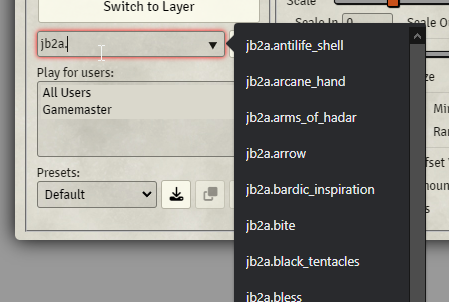

## Global Reference

You can access the global Sequencer Effect Manager through:

```js
Sequencer.Player
```

## Show Effect Player

You can either call this method:
```js
Sequencer.Player.show()
```
Or press this button


This will open this UI, where you can begin to play effects on the canvas. This will set the current layer to the Sequencer Layer, which means you cannot select tokens or such anymore.



## Playing Effects

When you have activated the Sequencer Layer by pressing the button described above, you can click and drag on the canvas and you'll get a cursor like this:


This is to help you know where your effects will end up. You can click to play effects on the spot, and you can click and drag to play the effect between two locations.

By typing into the input field at the top of the Player, you'll get suggestions for things to play. If you do not have any suggestions, you need to install an asset pack that uses the Sequencer Database, such as the [Jules & Ben Animated Assets](https://foundryvtt.com/packages/JB2A_DnD5e).



You can also choose your own file path by clicking the button next to the field.

## Presets

At the very bottom of the Player, there is a drop-down field. By pressing the button next to it, you will create a preset with the current active settings.

By selecting another preset, you will load that preset. If you wish to save or delete the settings of a preset, simply select it, make your changes and click the save button, or the delete button to delete it.
