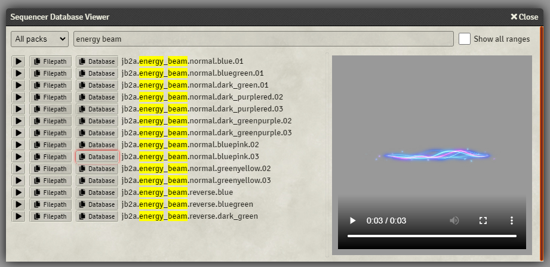

This guide will cover the basics how to play an effect that'll look like it's linking two tokens together and follow them when they move.

We're going create a normal macro, which will use Sequencer to play effects from JB2A's asset pack between the two tokens.

You can scroll to the bottom to find the [finished macro](#final-macro).


<hr/>

# Macro

## Preword

You will see a lot of `> Macro so far` after every step. You can click on this to see what the macro should look like at that step.

<hr/>

## Required modules

- [Sequencer](https://foundryvtt.com/packages/sequencer)
- [JB2A - Jules & Ben's Animated Assets](https://foundryvtt.com/packages/JB2A_DnD5e) (or the patreon version)

<hr/>

## Steps:

1. [Create a new macro](#_1-Create-a-new-macro)
2. [Make a new Sequence](#_2-Make-a-new-Sequence)
3. [Start an effect section](#_3-Start-an-effect-section)
4. [Choose an animation for the effect](#_4-Choose-an-animation-for-the-effect)
5. [Attach to the token](#_5-Attach-to-the-token)
6. [Stretch to and attach to the target](#_6-Stretch-to-and-attach-to-the-target)
7. [Make the effect last indefinitely and play the effect](#_7-Make-the-effect-last-indefinitely-and-play-the-effect)

<hr/>

### 1. Create a new macro

Start off by creating a new macro by clicking an empty hotbar space. If there are none, you can always create one through the Macro Directory by clicking the folder icon to the left of the bar, and then clicking **Create Macro**.

Remember to set the macro to **Type: script**!

<hr/>

### 2. Make a new Sequence

Since we can't play an effect without a Sequence, just add `new Sequence()` to the macro.

<details>
  <summary><strong>Macro so far</strong></summary><br />

```js
new Sequence();
```

</details>

<hr/>

### 3. Start an effect section

And, since we're playing an effect, you'll want to add `.effect()` below the `new Sequence()` line.

<details>
  <summary><strong>Macro so far</strong></summary><br />

```js
new Sequence().effect();
```

</details>

<hr/>

### 4. Choose an animation for the effect

Now, normally you'd just add a file to this, but due to how the JB2A effects are made, the start and the end points aren't on the edges of the animation file, but inside of the bounds of the effect. Instead, we're going to use the **Sequencer Database path** instead. You can get the Database Path to the energy beam by simply clicking on this button:


If you search for `energy beam` in that, you'll see this:



Simply click on the `Database` button on the `jb2a.energy_beam.normal.bluepink.03`, and you'll have copied the **Sequencer Database path** to the effect.

Add a `.file()` section and paste the copied `jb2a.energy_beam.normal.bluepink.03` into it.

<details>
  <summary><strong>Macro so far</strong></summary><br />

```js
new Sequence().effect().file("jb2a.energy_beam.normal.bluepink.03");
```

</details>

<hr/>

### 5. Attach to the token

In order for the effect to be **attached to** the token, we'll need to add `.attachTo(token)` in order for this effect to stay attached to it.

<details>
  <summary><strong>Macro so far</strong></summary><br />

```js
new Sequence()
  .effect()
  .file("jb2a.energy_beam.normal.bluepink.03")
  .attachTo(token);
```

</details>

<hr/>

### 6. Stretch to and attach to the target

Now that we've got an effect that's attached to the source, now we need a target to attach to.

In order to get the first of your current targets, we recommend you add this to the top of the macro:

```js
const target = game.user.targets.first();
```

This will take the list of tokens you currently have targeted, and pick the first one. If you don't have one targeted, the macro will fail with an error.

Then, add the following to the bottom of the macro - `.stretchTo(target, { attachTo: true })` - this means that the effect will be **stretched to** the target, and then **attached** to it, making it linked between the token and the target.

<details>
  <summary><strong>Macro so far</strong></summary><br />

```js
const target = game.user.targets.first();

new Sequence()
  .effect()
  .file("jb2a.energy_beam.normal.bluepink.03")
  .attachTo(token)
  .stretchTo(target, { attachTo: true });
```

</details>

<hr/>

### 7. Make the effect last indefinitely and play the effect

Now, add `.persist()` to the bottom, which will make the effect last until it is ended through the [Sequencer Effect Manager](../effect-manager.md).

Then, at the very end, just add `.play()`. Think of the Sequence as the recipe, but in order to actually cook everything we've assembled, we need to `.play()` it.

<details>
  <summary><strong>Macro so far</strong></summary><br />

```js
const target = game.user.targets.first();

new Sequence()
  .effect()
  .file("jb2a.energy_beam.normal.bluepink.03")
  .attachTo(token)
  .stretchTo(target, { attachTo: true })
  .persist()
  .play();
```

</details>

<hr/>

## Final Macro

Select a token, target another token, run the macro.

```js
const target = game.user.targets.first();

new Sequence()
  .effect()
  .file("jb2a.energy_beam.normal.bluepink.03")
  .attachTo(token)
  .stretchTo(target, { attachTo: true })
  .persist()
  .play();
```


**Note:** Remember that this effect is ended through the [Sequencer Effect Manager](../effect-manager.md)
